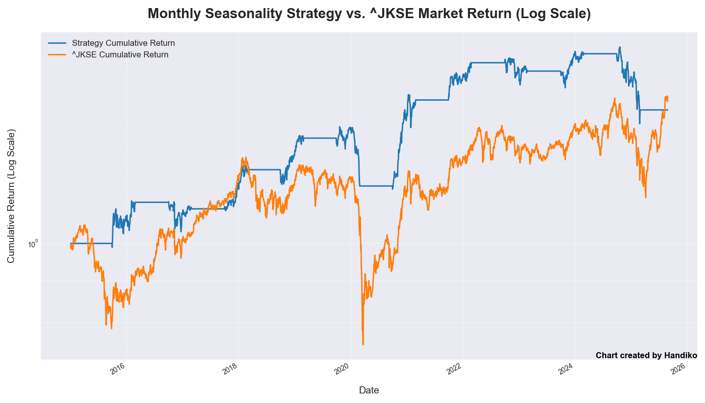
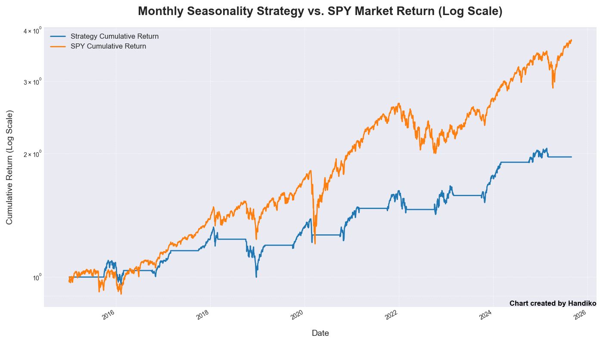

# Monthly Seasonality Trading Strategy Backtest
This Python script is designed to backtest a monthly seasonality trading strategy for a given stock or financial instrument. A "monthly seasonality strategy" is a simple trading approach that takes advantage of historical patterns where a security's price tends to perform better during specific months of the year.

## How it Works
The script operates in three main parts: the backtesting engine, the plotting function, and the main execution block.
1. Backtesting Engine (backtest_monthly_strategy)
This is the core of the script, where the trading strategy is simulated.
* Inputs: The function requires a stock ticker (e.g., 'GC=F' for Gold Futures), a buy month, a sell month, and a start and end date for the backtest.
  ```python
  # User-defined parameters
    TICKER = 'GC=F'
    BUY_MONTH = 12  # December
    SELL_MONTH = 4  # April
    START_DATE = '2015-01-01'
    END_DATE = '2025-08-31'
  ```
* Data Retrieval: It uses the yfinance library to download historical price data from Yahoo Finance. The script intelligently checks for 'Adj Close' (Adjusted Closing) price first, as this accounts for corporate actions like dividends and stock splits, providing a more accurate representation of returns. If that data is unavailable, it defaults to the standard 'Close' price.
* Signal Generation: The script iterates through the historical data, identifying the first trading day of the specified buy and sell months.
  a. On the first day of the buy month, it generates a "buy" signal and enters a position.
  b. On the first day of the sell month, it generates a "sell" signal and exits the position.
* Return Calculation: Based on these signals, the script calculates the cumulative returns of the strategy. It also calculates the cumulative returns of a simple "buy and hold" approach for the same period, which serves as a benchmark to evaluate the strategy's performance.

2. Visualization (plot_returns)
This function is responsible for creating a visual representation of the backtest results.
* Comparison Plot: It uses the matplotlib library to generate a plot that compares the cumulative returns of the monthly seasonality strategy against the cumulative returns of the simple market benchmark.
* Logarithmic Scale: The y-axis of the plot is set to a logarithmic scale, which is useful for visualizing long-term growth and comparing performance across different magnitudes.
* Labels and Title: The plot is clearly labeled and includes a title, a legend, and an author credit at the bottom. The final plot is saved as an image file for easy reference.

3. Main Execution Block
This is where you can customize and run the backtest.
* Parameters: In this section, you can easily change the ticker, buy month, sell month, and the date range for your backtest.
* Execution: When the script is run, it calls the backtest_monthly_strategy function to perform the simulation. It then passes the results to the plot_returns function to create the chart. Finally, it prints the total percentage returns for both the strategy and the market to the console, providing a quick summary of the performance.

In essence, this script provides a powerful and easy-to-use tool for quickly evaluating whether a simple, rule-based trading strategy would have been profitable in the past.

Code: [here](https://github.com/handiko/Monthly-Seasonality-Trading-Strategy-Backtest/blob/main/JupyterNotebook/Monthly%20Seasonality%20Strategy.ipynb)

---

## Examples
### Gold Contract (GC=F)


### IDX Composite (^JKSE)


### S&P 500 (SPY)


### Bitcoin (BTC-USD)


---

## Related Project
[Market Seasonality Chart Generator](https://github.com/handiko/Market-Seasonality-Chart-Generator/blob/main/README.md)

---
